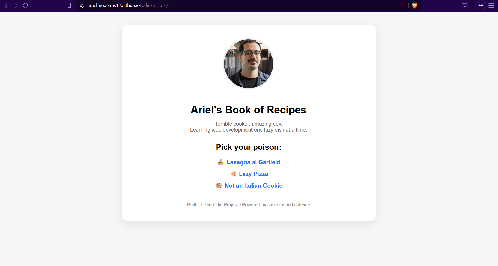

# Odin Recipes

A small multi-page recipe website built as part of The Odin Project Foundations course.

This project focuses on learning the fundamentals of HTML, file structure, and basic web navigation while building something simple, functional, and slightly fun.

## Preview

## Live Site
https://arielmedeiros13.github.io/odin-recipes/

## Concepts Practiced
- HTML boilerplate and page structure
- Lists (ordered and unordered)
- Links and multi-page navigation
- Images and relative paths
- Basic project file organization

## What I Learned
- How HTML pages connect to each other
- How to manage relative paths for assets and pages
- Basic Git workflow (add, commit, push)
- Deploying a static site using GitHub Pages

## Notes
I allowed myself a bit of creative freedom with the tone and writing — the goal was to learn while keeping the project enjoyable.

If you're reading this, I hope you have as much fun browsing it as I had building it 🙂